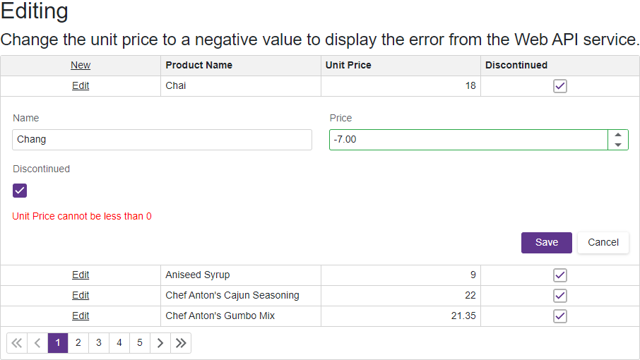

<!-- default badges list -->

[](https://supportcenter.devexpress.com/ticket/details/T1118926)
[](https://docs.devexpress.com/GeneralInformation/403183)
[](#does-this-example-address-your-development-requirementsobjectives)
<!-- default badges end -->
# Grid for Blazor - How to display an error message from the Web API Service

This example demonstrates how to display an error message from the Web API Service when the criteria is not met during editing. 



In the Web API Service controller, return a bad request error when the edited value does not meet the criteria.

```cs
public async Task<IActionResult> PutProducts(int id, Products products) {
    if (id != products.ProductId) {
        return BadRequest();
    }
    if (products.UnitPrice < 0) {
        return BadRequest("Unit Price cannot be less than 0");
    }
    _context.Entry(products).State = EntityState.Modified;
    await _context.SaveChangesAsync();
    return NoContent();
}
```

In the razor page, handle the [DxGrid.EditModelSaving](https://docs.devexpress.com/Blazor/DevExpress.Blazor.DxGrid.EditModelSaving) event to get the error message from the Web API service. Then, set the event's `e.Cancel` property to `true`.

```cs
private string MyErrorMessage { get; set; }
async Task Grid_EditModelSaving(GridEditModelSavingEventArgs e) {
    MyErrorMessage = null;
    var editedProduct = (Products)e.EditModel;
    var httpContent = ConvertProductToHttpContent(editedProduct);
    var response = e.IsNew == false
        ? await HttpClient.PutAsync(ProductsUrl + editedProduct.ProductId, httpContent)
        : await HttpClient.PostAsync(ProductsUrl, httpContent);
    if (response.IsSuccessStatusCode) 
        Products = await LoadDataAsync();
    else {
        e.Cancel = true;
        MyErrorMessage = await response.Content.ReadAsStringAsync();
    }
}
```

Display the error message in the `EditFormTemplate`.

```razor
<EditFormTemplate Context="editFormContext">
    <DxFormLayout>
        <DxFormLayoutItem Caption="Name">
            @editFormContext.GetEditor("ProductName")
        </DxFormLayoutItem>
        <DxFormLayoutItem Caption="Price">
            @editFormContext.GetEditor("UnitPrice")
        </DxFormLayoutItem>
        <DxFormLayoutItem Caption="Discontinued">
            @editFormContext.GetEditor("Discontinued")
        </DxFormLayoutItem>
        @if (String.IsNullOrEmpty(MyErrorMessage) == false) {
            <DxFormLayoutItem ColSpanMd="12">
                <div style="color:red">@MyErrorMessage</div>
            </DxFormLayoutItem>
        }
    </DxFormLayout>
</EditFormTemplate>
```

## Files to Look At

* [Grid.razor](./CS/DxBlazorApplication1/DxBlazorApplication1/Pages/Grid.razor)
* [ProductsController.cs](./CS/MyTestWebService/MyTestWebService/Controllers/ProductsController.cs)

## Documentation

- [Get Started with Grid - Edit Data](https://docs.devexpress.com/Blazor/403625/grid/get-started-with-grid#edit-data)
- [Tutorial: Create a web API with ASP.NET Core](https://learn.microsoft.com/en-us/aspnet/core/tutorials/first-web-api?view=aspnetcore-2.2&tabs=visual-studio)
<!-- feedback -->
## Does this example address your development requirements/objectives?

[](https://www.devexpress.com/support/examples/survey.xml?utm_source=github&utm_campaign=blazor-dxgrid-display-error-message-from-web-api-service&~~~was_helpful=yes) [](https://www.devexpress.com/support/examples/survey.xml?utm_source=github&utm_campaign=blazor-dxgrid-display-error-message-from-web-api-service&~~~was_helpful=no)

(you will be redirected to DevExpress.com to submit your response)
<!-- feedback end -->
